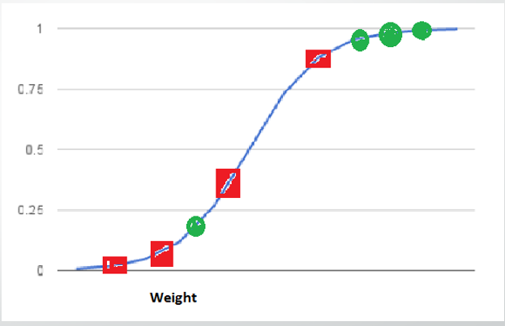
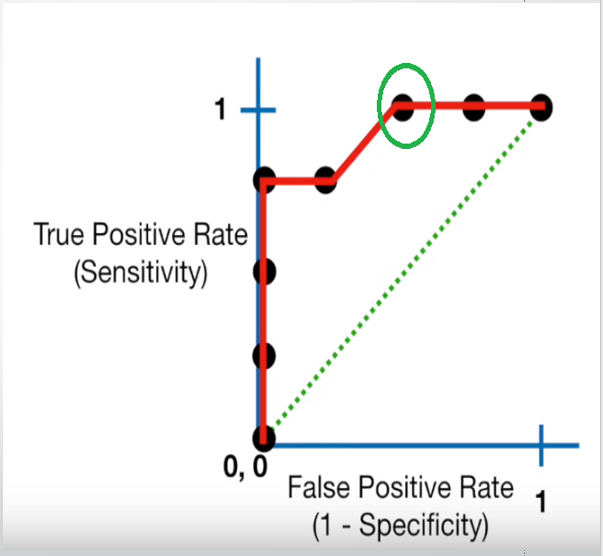
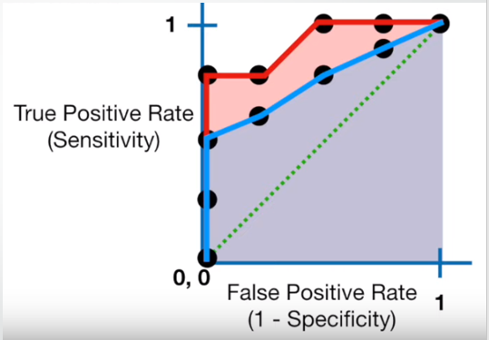

# Evaluation of a Classification Model

In machine learning, once we have a result of the classification problem, how do we measure how accurate our classification is? 

For a regression problem, we have different metrics like R Squared score, Mean Squared Error etc. what are the metrics to measure the credibility of a classification model?

Metrics In a regression problem, the accuracy is generally measured in terms of the difference in the actual values and the predicted values. 

In a classification problem, the credibility of the model is measured using the confusion matrix generated, i.e., how accurately the true positives and true negatives were predicted. The different metrics used for this purpose are:

1. Accuracy
2. Recall
3. Precision
4. F1 Score
5. Specifity
6. AUC( Area Under the Curve)
7. RUC(Receiver Operator Characteristic)
8. Confusion Matrix

# Lets look at each one by one

# 8. Confusion Matrix

A typical confusion matrix looks like: https://images.app.goo.gl/K5vdLfgPhZEDJij3A

Where the terms have the meaning:

- True Positive(TP): A result that was predicted as positive by the classification model and also is positive

- True Negative(TN): A result that was predicted as negative by the classification model and also is negative

- False Positive(FP): A result that was predicted as positive by the classification model but actually is negative

- False Negative(FN): A result that was predicted as negative by the classification model but actually is positive.

The Credibility of the model is based on how many correct predictions did the model do.

In the famous cancer example:
- Cases in which the doctor predicted YES (they have the disease), and they do have the disease will be termed as 
        TRUE POSITIVES (TP). The doctor has correctly predicted that the patient has the disease.
- Cases in which the doctor predicted NO (they do not have the disease), and they don’t have the disease will be 
        termed as TRUE NEGATIVES (TN). The doctor has correctly predicted that the patient does not have the disease.
- Cases in which the doctor predicted YES, and they do not have the disease will be termed as FALSE POSITIVES (FP).
         Also known as “Type I error”.
- Cases in which the doctor predicted NO, and they have the disease will be termed as FALSE NEGATIVES (FN). Also 
        known as “Type II error”.

# 1. Accuracy
The mathematical formula is : https://images.app.goo.gl/XV8daDFNZj5mCxZU7

Accuracy= (TP+TN)/(TP+TN+FP+FN)

Or, it can be said that it’s defined as the total number of correct classifications divided by the total number of classifications.

# 2. Recall or Sensitivity

The mathematical formula is: https://images.app.goo.gl/T46iu9fhXLkADvto9

Recall= TP/(TP+FN)

Or, as the name suggests, it is a measure of: from the total number of positive results how many positives were correctly predicted by the model.

It shows how relevant the model is, in terms of positive results only.

Let’s suppose in the previous model, the model gave 50 correct predictions(TP) but failed to identify 200 cancer patients(FN). Recall in that case will be:

Recall=50/(50+200)= 0.2 (The model was able to recall only 20% of the cancer patients)

# 3. Precision

Precision is a measure of amongst all the positive predictions, how many of them were actually positive. 

The mathematical formula is: https://images.app.goo.gl/T46iu9fhXLkADvto9

Precision= TP/(TP+FP)

Let’s suppose in the previous example, the model identified 50 people as cancer patients(TP) but also raised a false alarm for 100 patients(FP). Hence,

Precision=50/(50+100)=0.33 (The model only has a precision of 33%)

## But we have a problem!!
As evident from the previous example, the model had a very high Accuracy but performed poorly in terms of Precision and Recall. So, necessarily Accuracy is not the metric to use for evaluating the model in this case.

Imagine a scenario, where the requirement was that the model recalled all the defaulters who did not pay back the loan. Suppose there were 10 such defaulters and to recall those 10 defaulters, and the model gave you 20 results out of which only the 10 are the actual defaulters. Now, the recall of the model is 100%, but the precision goes down to 50%.

### A Trade-off?

As observed from the graph, with an increase in the Recall, there is a drop in Precision of the model.

So the question is - what to go for? Precision or Recall?

Well, the answer is: it depends on the business requirement.

For example, if you are predicting cancer, you need a 100 % recall. But suppose you are predicting whether a person is innocent or not, you need 100% precision.

Can we maximise both at the same time? No

So, there is a need for a better metric then?

Yes. And it’s called an F1 Score

# 4. F1 Score
From the previous examples, it is clear that we need a metric that considers both Precision and Recall for evaluating a model. One such metric is the F1 score.

F1 score is defined as the harmonic mean of Precision and Recall.

The mathematical formula is: https://images.app.goo.gl/u1axhz9ALGZBqB2V7

F1 score= 2∗((Precision∗Recall)/(Precision+Recall))

# 5. Specificity or True Negative Rate
This represents how specific is the model while predicting the True Negatives. 

Mathematically, https://images.app.goo.gl/D3aqKvbHtH5VgFwV9

Specificity=TN/(TN+FP) 

Or, it can be said that it quantifies the total number of negatives predicted by the model with respect to the total number of actual negative or non favorable outcomes.

Similarly, 

## False Positive rate 

False Positive rate can be defined as: (1- specificity) Or, FP(TN+FP)

# 7. ROC(Receiver Operator Characteristic)

We know that the classification algorithms work on the concept of probability of occurrence of the possible outcomes. A probability value lies between 0 and 1. Zero means that there is no probability of occurrence and one means that the occurrence is certain.

But while working with real-time data, it has been observed that we seldom get a perfect 0 or 1 value. Instead of that, we get different decimal values lying between 0 and 1. Now the question is if we are not getting binary probability values how are we actually determining the class in our classification problem?

There comes the concept of Threshold. A threshold is set, any probability value below the threshold is a negative outcome, and anything more than the threshold is a favourable or the positive outcome. For Example, if the threshold is 0.5, any probability value below 0.5 means a negative or an unfavourable outcome and any value above 0.5 indicates a positive or favourable outcome.

Now, the question is, what should be an ideal threshold?

The following diagram shows a typical logistic regression curve. 

- The horizontal lines represent the various values of thresholds ranging from 0 to 1.
- Let’s suppose our classification problem was to identify the obese people from the given data.
- The green markers represent obese people and the red markers represent the non-obese people.
- Our confusion matrix will depend on the value of the threshold chosen by us.
- For Example, if 0.25 is the threshold then
  TP(actually obese)=3
  TN(Not obese)=2
  FP(Not obese but predicted obese)=2(the two red squares above the 0.25 line)
  FN(Obese but predicted as not obese )=1(Green circle below 0.25line  )

A typical ROC curve looks like the following figure. 

[image source](https://images.app.goo.gl/YDGVjGnGNHH9iwEk7)
- Mathematically, it represents the various confusion matrices for various thresholds. Each black dot is one confusion matrix.
- The green dotted line represents the scenario when the true positive rate equals the false positive rate.
- As evident from the curve, as we move from the rightmost dot towards left, after a certain threshold, the false positive rate decreases.
- After some time, the false positive rate becomes zero.
- The point encircled in green is the best point as it predicts all the values correctly and keeps the False positive as a minimum.
- But that is not a rule of thumb. Based on the requirement, we need to select the point of a threshold.
- The ROC curve answers our question of which threshold to choose.

ROC (Receiver Operating Characteristic) 
- Curve tells us about how good the model can distinguish between two things (e.g If a patient has a disease or no). 
- Better models can accurately distinguish between the two. 
        Whereas, a poor model will have difficulties in distinguishing between the two

- Well Explained in this video: https://www.youtube.com/watch?v=OAl6eAyP-yo

## But we have a confusion!!
- Let’s suppose that we used different classification algorithms, and different ROCs for the corresponding algorithms have been plotted. 
- The question is: which algorithm to choose now? The answer is to calculate the area under each ROC curve.

# 6. AUC(Area Under Curve)

[image source](https://images.app.goo.gl/YDGVjGnGNHH9iwEk7)

- It helps us to choose the best model amongst the models for which we have plotted the ROC curves
- The best model is the one which encompasses the maximum area under it.
- In the adjacent diagram, amongst the two curves, the model that resulted in the red one should be chosen as it clearly covers more area than the blue one

